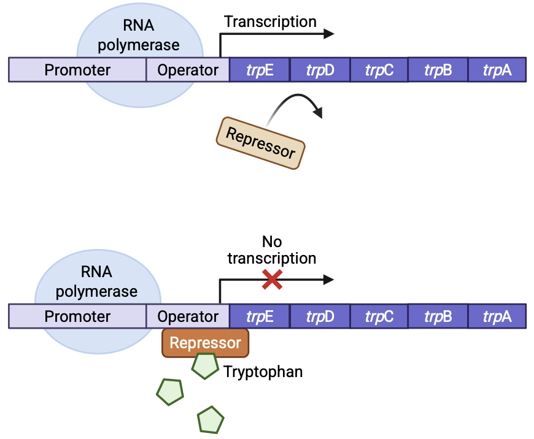
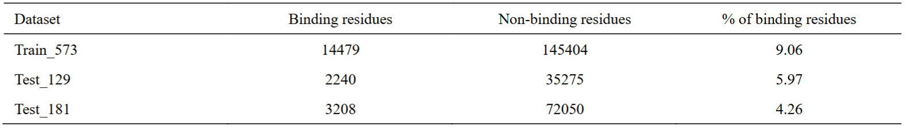
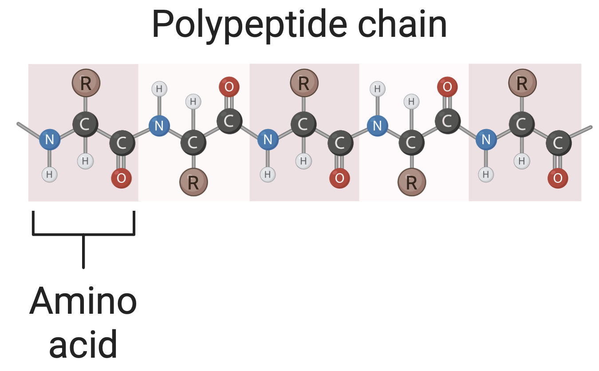
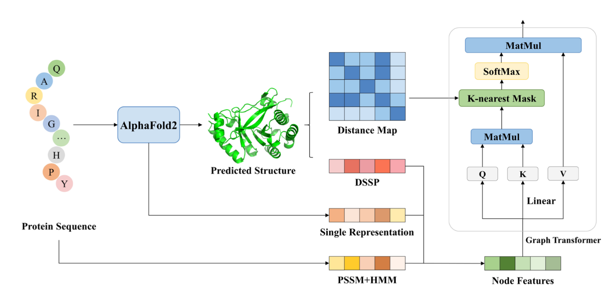
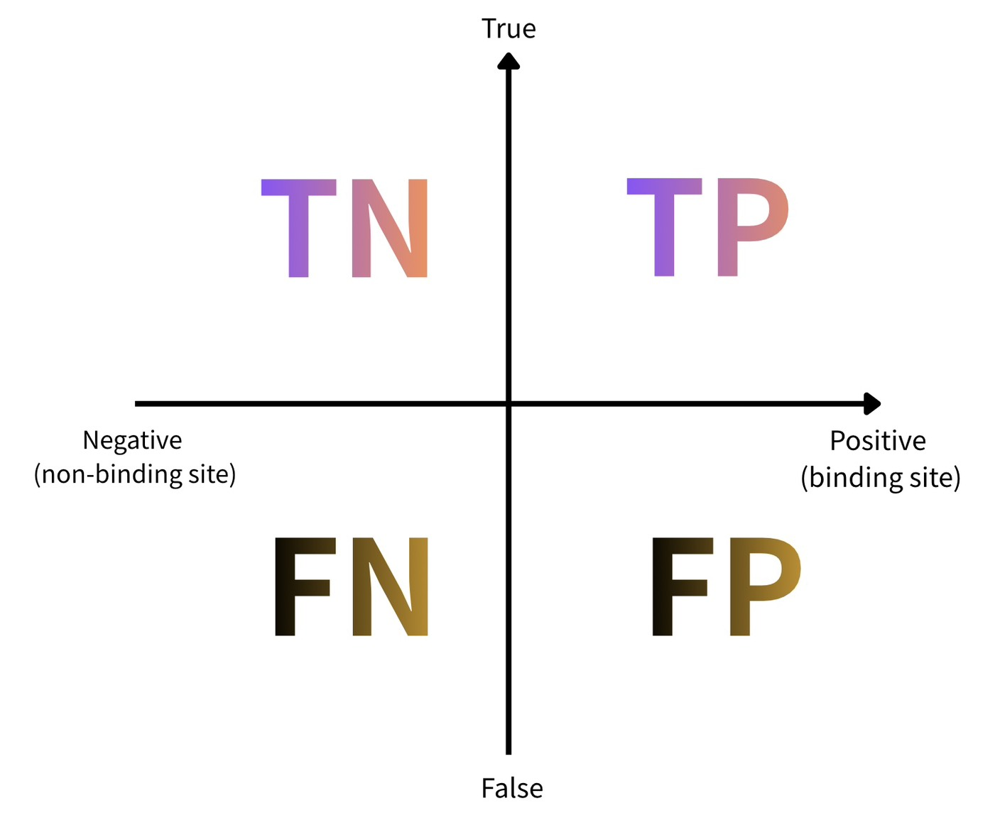
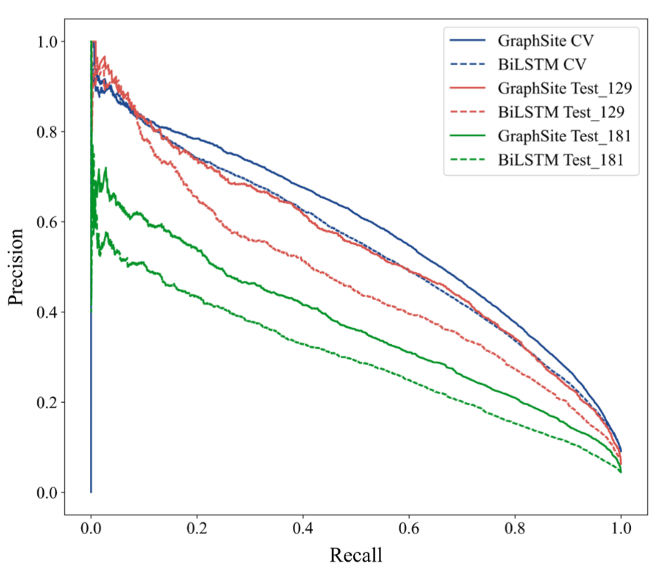
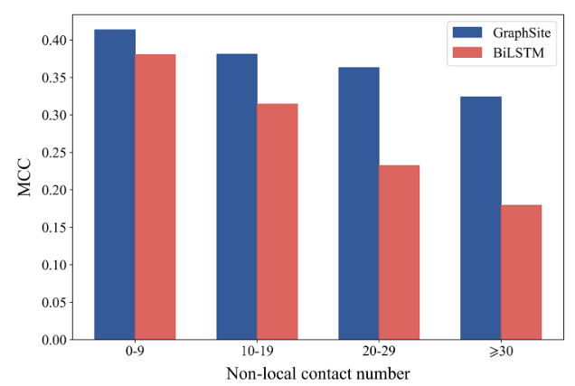
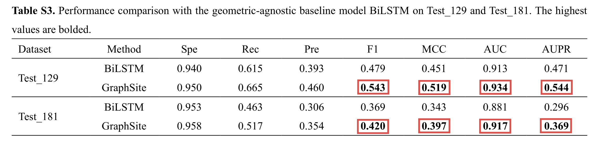
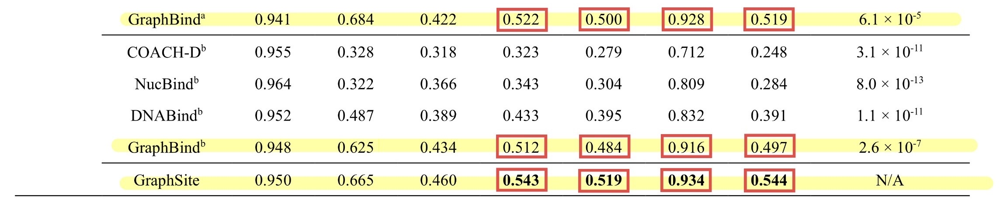

<!-- _class: lead -->

# AlphaFold2-aware protein-DNA binding site prediction using graph transformer

### Qianmu Yuan, Sheng Chen, Jiahua Rao, Shuangjia Zheng, Huiying Zhao, and Yuedong Yang

---
## Protein-DNA binding

  
  

---
## 🧬 蛋白質-DNA 交互作用的重要性

- **生命運作的核心**
  - 基因轉錄調控
  - DNA 修復機制
  - 信號傳導路徑

- **應用價值**
  - 理解疾病機理
  - 開發新型藥物
  - 精準醫學研究

---
## ⚠️ 傳統實驗方法的限制

### X 射線晶體學的挑戰

- ⏰ **耗時長**：單一結構可能需要數月到數年
- 💰 **成本高**：設備與人力成本昂貴
- 📊 **適用性受限**：並非所有蛋白質都能結晶

### 計算方法的迫切需求

開發**快速、精準、低成本**的預測方法成為關鍵

---
## 💡 GraphSite 的創新價值

### 核心突破

✅ 僅需蛋白質**序列**作為輸入
✅ 利用 **AlphaFold2** 結構預測
✅ 結合**Graph Transformer**深度學習架構
✅ 達到甚至**超越**實驗結構方法的準確性

---
<!-- _class: lead -->

## GraphSite 核心方法論

---
### 資料集（Datasets）
Train_573 與 Test_129 、 Test_181（名稱取自各自所含蛋白質數目）
來自 BioLiP 資料庫和 PDB（Protein Data Bank）
- 核心的資訊是**胺基酸殘基** (amino acid residue) 是否為 DNA 結合殘基
- Table 1:

---
### 蛋白質表示（Protein representation）
將蛋白質結構和序列資訊轉化為 **graph node classification problem**:
一條含有 $𝑛$ 個胺基酸的蛋白質，以節點特徵矩陣 $𝑋$ 與距離矩陣 $𝐷$ 表示

---
### 節點特徵矩陣 $X \in \mathbb{R}^{n \times 438}$
1. **📊 MSA (Multi-Sequence Alignment) 資訊**
   - AlphaFold2 Single Representation：
    在結構預測過程中輸出的特徵 ⭐ *貢獻最大*
   - PSSM (Position-Specific Scoring Matrix)
   - HMM (Hidden Markov Models)

    AlphaFold2 (384 維) + PSSM (20 維) + HMM (20 維)

---
### 節點特徵矩陣 $X \in \mathbb{R}^{n \times 438}$
**2. 🏗️ 結構屬性 (Structural Properties)**
   DSSP（Dictionary of Protein Secondary Structure）：
   從 AlphaFold2 預測的蛋白質結構中提取
   - one-hot secondary structure (9 維)
   - Peptide backbone torsion angles PHI and PSI (4 維)
   - Relative solvent accessibility (1 維)

### 距離矩陣 $D\in \mathbb{R}^{n \times n}$
- 來源: 根據 AlphaFold2 預測的蛋白質結構模型計算而來
- 胺基酸殘基的原子座標 $C_{\alpha}$，計算所有殘基對之間的歐幾里得距離

---
### Graph transformer
$H=[h_1^{T},...,h_n^{T}]^{T} \in R^{n \times d}$

- 初始 $H^{(0)}$ 和 節點特徵矩陣 $X \in \mathbb{R}^{n \times 438}$:

$$H^{(0)} = \sigma(XW_{in}+b) \quad W_{in} \in \mathbb{R}^{438 \times d}, \quad b \in \mathbb{R}^{d}$$

- $W_{Q},W_{K},W_{V} \in R^{d×d_K}$ 其中 $d_K = \frac{d}{h}$
$$
\underset{\text{(queries)}}{Q} = H^{(l)}W_{Q},
\quad
\underset{\text{(keys)}}{K} = H^{(l)}W_{K},
\quad
\underset{\text{(values)}}{V} = H^{(l)}W_{V}.
$$

d: hidden dimension, h: attention heads

---
自注意力的打分計算為:
$$\text{A} = \frac{QK^{T}}{\sqrt{d_{K}}}+M,$$
$$H^{(l+1)} = Attn(H^{(l)}) = \text{softmax}(\text{A})V.$$
$A$ 度量了查詢與鍵之間的相似度

### k-近鄰遮罩定義

$$
M_{ij} = \begin{cases}
1, & \text{if } j \in \mathcal{N}_k(i) \\
-\infty, & \text{otherwise}
\end{cases}
$$

其中 $\mathcal{N}_k(i)$ 是殘基 $i$ 的 $k$ 個最近 (由矩陣$D$判斷) 鄰居集合

---
### 多頭注意力機制 (Multi-Head Attention)
預測所有 n個氨基酸殘基的 DNA 結合機率:
$$Y' = \sigma(H^{(L)}W + b)$$

其中：
- $\mathbf{H}^{(L)}$：第 L 層轉換器輸出
- $\sigma$：Sigmoid 激活函數
- $\hat{y}_i \in [0, 1]$：殘基 $i$ 為結合位點的機率
---

Figure 1.

---

<!-- _class: lead -->
## 性能評估與比較

---
## GraphSite vs. RiLSTM

| 方法 | **GraphSite** | **RiLSTM** |
|:---:|:---:|:---:|
| 主要方法 | Graph Transformer Network |  two-layer bidirectional long short-term memory networkand an MLP module |
| 任務視角 | 將結合位點預測視為圖節點分類問題 | 幾何無關 (geometric-agnostic) 的基準模型 |

---
## 📊 評估指標定義: Precision Recall Curve (AUPR)
$\text{Precision} = \frac{TP}{TP + FP}, \quad \text{Recall} = \frac{TP}{TP + FN}$

---
### Precision Recall Curve (AUPR)

Figure 2

---
$$
\text{MCC} = \frac{TP \times TN - FP \times FN}{\sqrt{(TP+FP)(TP+FN)(TN+FP)(TN+FN)}}
$$

---
## 📊 性能提升幅度 (相對於 BiLSTM)

### 優勢來源

1️⃣ graph transformer 架構
2️⃣ k-nearest mask

---
## 📊 性能提升幅度 (相對於 GraphBind)

$^a$ Using native protein structures
$^b$ Using predicted protein structures
- GraphBind: 最新型的 structure-based predictor
1️⃣ GraphBind 沒有 single representation
2️⃣ GraphSite 的 graph transformer 模型被證明是強大的
3️⃣ GraphSite 使用的 AlphaFold2 能預測出高品質蛋白質結構

---
<!-- _class: lead -->

## 總結

### GraphSite 標誌著
## 利用 AI 預測結構進行功能位點識別的重大突破

為蛋白質-DNA 交互研究
提供前所未有的強大工具

加速探索生命奧秘
攻克人類疾病

---

<!-- _class: lead -->

# 謝謝聆聽！

