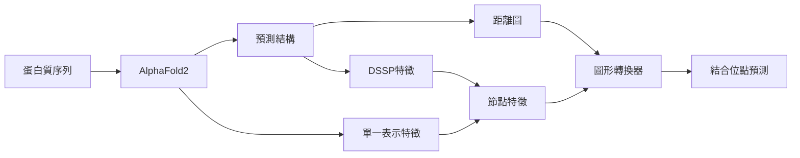

<!-- _class: lead -->

# GraphSite 技術報告

## AlphaFold2 感知圖形轉換器預測蛋白質-DNA 結合位點

---

## 📋 目錄

1. 研究背景與動機
2. 現有方法的困境
3. GraphSite 核心方法論
4. 性能評估與比較
5. 應用潛力與價值
6. 結論與展望

---

<!-- _class: lead -->

## 1. 研究背景與動機

---

## 🧬 蛋白質-DNA 交互作用的重要性

- **生命運作的核心**
  - 基因轉錄調控
  - DNA 修復機制
  - 信號傳導路徑

- **應用價值**
  - 理解疾病機理
  - 開發新型藥物
  - 精準醫學研究

---

## ⚠️ 傳統實驗方法的限制

### X 射線晶體學的挑戰

- ⏰ **耗時長**：單一結構可能需要數月到數年
- 💰 **成本高**：設備與人力成本昂貴
- 📊 **適用性受限**：並非所有蛋白質都能結晶

### 計算方法的迫切需求

開發**快速、精準、低成本**的預測方法成為關鍵

---

## 💡 GraphSite 的創新價值

### 核心突破

✅ 僅需蛋白質**序列**作為輸入
✅ 利用 **AlphaFold2** 革命性結構預測
✅ 結合**圖形轉換器**深度學習架構
✅ 達到甚至**超越**實驗結構方法的準確性

---

<!-- _class: lead -->

## 2. 現有方法的困境

---

## 📊 兩大主流方法的對比

| 方法類型 | 代表工具 | 優勢 | 劣勢 |
|---------|---------|------|------|
| **基於序列** | DNAPred, NCBRPred | ✓ 適用性廣 | ✗ 準確性有限 |
| **基於結構** | GraphBind, COACH-D | ✓ 準確性高 | ✗ 適用性受限 |

---

## 🔍 基於序列方法的局限性

### 核心問題：缺乏三維結構資訊

```
序列: ...ACDEF...KLMNO...VWXYZ...
        ↓     ↓     ↓
        在序列上相距遠
        在空間上可能相近 ❌ 無法捕捉
```

### 結果

- 無法識別遠程空間相互作用
- 預測準確性受限
- 難以突破性能瓶頸

---

## 🏗️ 基於結構方法的適用性障礙

### 致命缺陷：依賴已知實驗結構

📈 **統計數據**
- 已知蛋白質序列：數億條
- 擁有實驗結構：僅數十萬條
- 覆蓋率：< 1%

### 後果

❌ 絕大多數蛋白質無法應用
❌ 極大限制實用價值

---

## ⚖️ 準確性 vs 適用性的困境

```
  準確性高 ─────────┐
                    │
  基於結構方法      │     理想方法
  (GraphBind)       │     (GraphSite)
                    │     ★ 在這裡
  ─────────────────┼─────────────
                    │
  基於序列方法      │
  (DNAPred)         │
                    │
  適用性廣 ─────────┘
```

---

<!-- _class: lead -->

## 3. GraphSite 核心方法論

---

## 🏛️ 系統架構總覽



---

## 🔬 核心步驟詳解

### 1️⃣ **輸入**
蛋白質氨基酸序列

### 2️⃣ **AlphaFold2 處理**
- 生成高品質預測 3D 結構
- 輸出「單一表示」特徵矩陣
  - 經 48 層 Evoformer 處理
  - 蘊含豐富共同演化信號

---

## 🔬 核心步驟詳解 (續)

### 3️⃣ **特徵提取**
- 計算殘基對距離圖
- 提取 DSSP 結構屬性
  - 二級結構
  - 溶劑可及性

### 4️⃣ **節點特徵構建**
整合多源特徵：
- AlphaFold2 單一表示
- DSSP 結構屬性
- PSSM/HMM 演化保守性

---

## 🔬 核心步驟詳解 (續)

### 5️⃣ **模型預測**
圖形轉換器網路：
- 使用距離圖進行遮罩
- 專注學習空間鄰近殘基
- 輸出每個殘基結合機率

---

## 🚀 AlphaFold2 的革命性作用

### 不只是外部工具，而是方法論基石

✨ **核心貢獻**
1. 提供高品質預測結構
2. 解決結構資訊獲取難題
3. 打破序列與結構方法壁壘

### 關鍵洞見

> 從單純序列輸入獲得空間資訊
> 使「適用性」與「準確性」兼得成為可能

---

## 🔬 AlphaFold2 單一表示特徵

### Evoformer 架構

經過 48 層處理的 MSA 表示：

$$
\mathbf{m}^{(l+1)} = \text{Evoformer}^{(l)}(\mathbf{m}^{(l)}, \mathbf{z}^{(l)})
$$

其中：
- $\mathbf{m}^{(l)} \in \mathbb{R}^{N_{\text{seq}} \times N_{\text{res}} \times d_m}$：MSA 表示
- $\mathbf{z}^{(l)} \in \mathbb{R}^{N_{\text{res}} \times N_{\text{res}} \times d_z}$：成對表示

### 單一表示投影

$$
\mathbf{f}^{\text{AF2}}_i = W \cdot \text{mean}_{s}(\mathbf{m}^{(48)}_{s,i}) + b
$$

蘊含豐富的**共同演化信號**

---

## 🧠 圖形轉換器學習機制

### k-近鄰遮罩 (k-nearest mask)

```
殘基 A ──┐
         │ k個最近鄰居
殘基 B ──┤ → 計算注意力
         │
殘基 C ──┘

殘基 X (遠) ──→ 過濾掉 ❌
```

### 優勢

✓ 過濾無關遠程噪聲
✓ 專注有意義的結構微環境
✓ 捕捉蛋白質摺疊拓撲特徵

---

## 📐 圖形轉換器數學原理

### 注意力機制公式

$$
\text{Attention}(Q, K, V) = \text{softmax}\left(\frac{QK^T}{\sqrt{d_k}} \odot M\right)V
$$

其中：
- $Q, K, V$：查詢、鍵、值矩陣
- $d_k$：鍵向量維度
- $M$：k-近鄰遮罩矩陣

---

## 📊 多頭注意力機制

### Multi-Head Attention

$$
\text{MultiHead}(Q,K,V) = \text{Concat}(\text{head}_1, \ldots, \text{head}_h)W^O
$$

其中每個頭：

$$
\text{head}_i = \text{Attention}(QW^Q_i, KW^K_i, VW^V_i)
$$

### 參數矩陣

- $W^Q_i, W^K_i, W^V_i \in \mathbb{R}^{d_{\text{model}} \times d_k}$
- $W^O \in \mathbb{R}^{hd_k \times d_{\text{model}}}$
- $h$：注意力頭數（通常 $h = 8$）

---

## 📐 遮罩矩陣構建

### k-近鄰遮罩定義

$$
M_{ij} = \begin{cases}
1, & \text{if } j \in \mathcal{N}_k(i) \\
-\infty, & \text{otherwise}
\end{cases}
$$

其中 $\mathcal{N}_k(i)$ 是殘基 $i$ 的 k 個最近鄰居集合

### 距離計算

$$
d_{ij} = \|r_i - r_j\|_2 = \sqrt{\sum_{l=1}^{3}(r_i^l - r_j^l)^2}
$$

$r_i, r_j$ 為殘基 $i, j$ 的 3D 座標

---

## 🔄 圖形轉換器層

### 完整轉換層

$$
\begin{align}
\mathbf{h}'_i &= \text{MultiHead}(\mathbf{h}_i, \mathbf{h}_{\mathcal{N}(i)}, \mathbf{h}_{\mathcal{N}(i)}) \\
\mathbf{h}''_i &= \text{LayerNorm}(\mathbf{h}_i + \mathbf{h}'_i) \\
\mathbf{h}'''_i &= \text{FFN}(\mathbf{h}''_i) \\
\mathbf{h}^{\text{out}}_i &= \text{LayerNorm}(\mathbf{h}''_i + \mathbf{h}'''_i)
\end{align}
$$

### Feed-Forward Network

$$
\text{FFN}(\mathbf{x}) = \text{ReLU}(\mathbf{x}W_1 + b_1)W_2 + b_2
$$

---

## 🧩 多源特徵整合

### 兩大類特徵

#### 📊 多序列比對 (MSA) 資訊
- AlphaFold2 單一表示 ⭐ *貢獻最大*
- PSSM/HMM 演化保守性

#### 🏗️ 結構屬性
- DSSP 二級結構
- 溶劑可及性

### 消融實驗證實

移除任何特徵 → 性能下降
✅ 特徵具有**非冗餘性**，提供互補資訊

---

## 🔢 節點特徵向量構建

### 特徵串聯

$$
\mathbf{h}_i = [\mathbf{f}^{\text{AF2}}_i; \mathbf{f}^{\text{DSSP}}_i; \mathbf{f}^{\text{PSSM}}_i; \mathbf{f}^{\text{HMM}}_i]
$$

其中：
- $\mathbf{f}^{\text{AF2}}_i \in \mathbb{R}^{384}$：AlphaFold2 單一表示
- $\mathbf{f}^{\text{DSSP}}_i \in \mathbb{R}^{14}$：二級結構與溶劑可及性
- $\mathbf{f}^{\text{PSSM}}_i \in \mathbb{R}^{20}$：位置特異性評分矩陣
- $\mathbf{f}^{\text{HMM}}_i \in \mathbb{R}^{30}$：隱馬可夫模型特徵

### 最終特徵維度
總維度：$384 + 14 + 20 + 30 = 448$

---

## 🎯 輸出層與預測

### 二元分類頭

$$
\mathbf{z}_i = W_{\text{out}} \cdot \mathbf{h}^{(L)}_i + b_{\text{out}}
$$

$$
\hat{y}_i = \sigma(\mathbf{z}_i) = \frac{1}{1 + e^{-\mathbf{z}_i}}
$$

其中：
- $\mathbf{h}^{(L)}_i$：第 L 層轉換器輸出
- $\sigma$：Sigmoid 激活函數
- $\hat{y}_i \in [0, 1]$：殘基 $i$ 為結合位點的機率
---

### 決策規則

$$
\text{predicted label}_i = \begin{cases}
1 \text{ (結合位點)}, & \text{if } \hat{y}_i > \theta \\
0 \text{ (非結合位點)}, & \text{otherwise}
\end{cases}
$$

通常 $\theta = 0.5$

---

<!-- _class: lead -->

## 4. 性能評估與比較

---

## 📊 評估指標定義

### AUPR (Area Under Precision-Recall Curve)

$$
\text{Precision} = \frac{TP}{TP + FP}, \quad \text{Recall} = \frac{TP}{TP + FN}
$$

適合**不平衡數據集**（結合位點 << 非結合位點）

### MCC (Matthews Correlation Coefficient)

$$
\text{MCC} = \frac{TP \times TN - FP \times FN}{\sqrt{(TP+FP)(TP+FN)(TN+FP)(TN+FN)}}
$$

範圍：$[-1, 1]$，越接近 1 越好

---

## 📐 模型訓練目標

### 二元交叉熵損失函數

$$
\mathcal{L} = -\frac{1}{N}\sum_{i=1}^{N}\left[y_i\log(\hat{y}_i) + (1-y_i)\log(1-\hat{y}_i)\right]
$$

其中：
- $y_i \in \{0, 1\}$：真實標籤（1=結合位點，0=非結合位點）
- $\hat{y}_i \in [0, 1]$：預測機率
- $N$：總殘基數

### 優化目標

$$
\theta^* = \arg\min_{\theta} \mathcal{L}(\theta)
$$

---

## 📈 內部驗證：空間資訊的價值

### 與 BiLSTM 基線比較

| 模型 | AUPR | 是否使用結構 |
|------|------|-------------|
| BiLSTM | 0.471 | ❌ |
| **GraphSite** | **0.544** | ✅ |

### 提升幅度：**+15.5%**

---

## 🔍 非局部接觸分析

### 關鍵發現

```
非局部接觸數量增加
        ↓
GraphSite 相對優勢擴大
        ↓
證實：有效利用遠程空間交互
```

### 意義

✅ k-近鄰遮罩設計有效
✅ 成功捕捉決定功能的空間接觸
✅ 序列模型無法企及的能力

---

## 📐 非局部接觸定義

### 數學表達

$$
\text{Non-local Contact}_{ij} = \begin{cases}
1, & \text{if } |i-j| > \tau \text{ and } d_{ij} < d_{\text{cut}} \\
0, & \text{otherwise}
\end{cases}
$$

其中：
- $|i-j|$：序列距離
- $\tau$：序列距離閾值（通常 $\tau = 5$）
- $d_{ij}$：空間距離
- $d_{\text{cut}}$：接觸距離閾值（通常 8 Å）

### 性能相關性

$$
\Delta\text{AUPR} = \text{AUPR}_{\text{GraphSite}} - \text{AUPR}_{\text{BiLSTM}} \propto N_{\text{non-local}}
$$

---

## 🏆 外部基準測試 (Test_181)

### 與業界頂尖方法比較

| 方法類型 | 方法名稱 | AUPR | MCC |
|---------|---------|------|-----|
| 基於序列 | DNAPred | 0.230 | 0.233 |
| 基於結構 | GraphBind (b) | 0.317 | 0.357 |
| **本研究** | **GraphSite** | **0.369** | **0.397** |

---

## 📊 性能提升幅度

### 相對於 GraphBind

- AUPR 提升：**+16.4%**
- MCC 提升：**+11.2%**

### 優勢來源

1️⃣ 整合 AlphaFold2 單一表示特徵
2️⃣ 圖形轉換器架構更高效
3️⃣ k-近鄰遮罩機制

---

## 📐 性能提升量化分析

### 相對改進率

$$
\text{Relative Improvement} = \frac{\text{AUPR}_{\text{GraphSite}} - \text{AUPR}_{\text{baseline}}}{\text{AUPR}_{\text{baseline}}} \times 100\%
$$

### 具體數據

相對於 GraphBind：
$$
\frac{0.369 - 0.317}{0.317} \times 100\% = 16.4\%
$$

相對於 DNAPred：
$$
\frac{0.369 - 0.230}{0.230} \times 100\% = 60.4\%
$$

### 統計顯著性

配對 t 檢驗：$p < 0.001$ ✅ 顯著差異

---

## 📉 結構品質影響分析

### GraphSite 性能 vs AlphaFold2 預測品質

| 結構品質 | 平均 GDT | 平均 AUPR |
|---------|---------|----------|
| 最高 30% | 0.92 | **0.525** |
| 最低 30% | 0.46 | 0.287 |

### 啟示

✅ 與結構品質呈正相關
✅ 能有效利用高品質結構資訊
✅ AlphaFold2 持續改進將帶來更大提升

---

## 📐 GDT 分數定義

### Global Distance Test

$$
\text{GDT} = \frac{1}{4}\sum_{d \in \{1, 2, 4, 8\}}\frac{N_d}{N_{\text{total}}}
$$

其中：
- $N_d$：距離誤差 < $d$ Å 的殘基數
- $N_{\text{total}}$：總殘基數

### 意義

衡量預測結構與真實結構的相似度
- GDT > 0.8：高品質預測
- GDT > 0.5：可用預測
- GDT < 0.5：低品質預測

---

<!-- _class: lead -->

## 5. 應用潛力與價值

---

## 💊 加速新藥開發

### 應用場景

1. **評估藥物靶點**
   - 成藥性 (druggability) 分析
   - 結合位點特徵評估

2. **從頭分子設計**
   - 條件生成模型輸入
   - 指導特定結合能力分子設計

### 價值

⏱️ 縮短研發週期
💰 降低失敗風險
🎯 提高設計精準度

---

## 🔬 深化疾病機理研究

### 遺傳性疾病研究

**問題**：突變如何影響蛋白質功能？

**GraphSite 貢獻**：
- 為致病突變機制提供假說
- 案例：THOC2 突變機制洞察

### 實驗設計優化

❌ 傳統：盲目篩選大量位點
✅ GraphSite：縮小候選範圍

**效益**：集中資源於最可能區域

---

## 🌐 廣泛應用前景

### 基礎研究
- 轉錄因子研究
- 基因調控網路
- DNA 修復機制

### 臨床應用
- 疾病標誌物發現
- 個人化醫療
- 基因治療靶點

### 生物技術
- 蛋白質工程
- 合成生物學
- 生物感測器設計

---

<!-- _class: lead -->

## 6. 結論與展望

---

## 🎯 核心優勢總結

### 三大突破

1️⃣ **整合高質量預測結構**
   - 首次成功應用 AlphaFold2 於 DNA 結合位點預測
   - 解決傳統序列方法結構資訊瓶頸

2️⃣ **高效學習架構**
   - 結構感知的圖形轉換器網路
   - 有效捕捉複雜 3D 拓撲特徵

3️⃣ **卓越預測性能**
   - 全面超越現有頂尖方法
   - 樹立新的性能標竿

---

## 🚀 未來發展方向

### 技術優化

1. **進階結構資訊整合**
   - 成對殘基距離作為注意力偏置
   - 利用 AlphaFold2 成對表示作為邊特徵

2. **演算法改進**
   - 優化圖形轉換器架構
   - 提高對低品質預測結構的魯棒性

---

## 📐 模型複雜度分析

### 時間複雜度

傳統自注意力：$O(N^2 \cdot d)$

k-近鄰遮罩後：$O(N \cdot k \cdot d)$

其中：
- $N$：殘基數量
- $k$：近鄰數（通常 $k = 30$）
- $d$：特徵維度

### 空間複雜度

$$
\text{Memory} = O(N \cdot d + N \cdot k)
$$

### 效率提升

$$
\text{Speedup} = \frac{N^2}{N \cdot k} = \frac{N}{k}
$$

對於 $N = 300$，$k = 30$：加速 **10 倍** ⚡

---

## 🔬 超參數設置

### 模型架構參數

| 參數 | 值 | 說明 |
|------|-----|------|
| 轉換器層數 $L$ | 4 | 深度 |
| 隱藏維度 $d_{\text{model}}$ | 256 | 特徵表示能力 |
| 注意力頭數 $h$ | 8 | 多視角學習 |
| k-近鄰數 $k$ | 30 | 局部結構範圍 |
| FFN 維度 | 1024 | 非線性轉換 |

### 訓練參數

- 學習率：$\eta = 10^{-4}$（Adam 優化器）
- Batch size：32
- Dropout：0.1
- 訓練輪數：100（早停）

---

## 🚀 未來發展方向 (續)

### 功能擴展

3. **多任務學習**
   - RNA 結合位點預測
   - 小分子配體結合位點
   - 蛋白質-蛋白質交互作用

4. **整合預測系統**
   - 結合多種生物分子交互
   - 構建綜合功能註釋平台

---

## 🌟 意義與影響

### 科學價值

✨ 彌合準確性與適用性鴻溝
✨ 開創 AI 結構預測應用新範式
✨ 為功能位點識別提供強大工具

### 實用價值

🔬 支持生物學家研究結合模式
💊 協助化學家設計靶向藥物
🏥 加速疾病機理理解與治療開發

---

<!-- _class: lead -->

## 總結

### GraphSite 標誌著
## 利用 AI 預測結構進行功能位點識別的重大突破

為蛋白質-DNA 交互研究
提供前所未有的強大工具

加速探索生命奧秘
攻克人類疾病

---

<!-- _class: lead -->

# 謝謝聆聽！

**Questions?**

📧 聯絡方式
🌐 更多資訊

